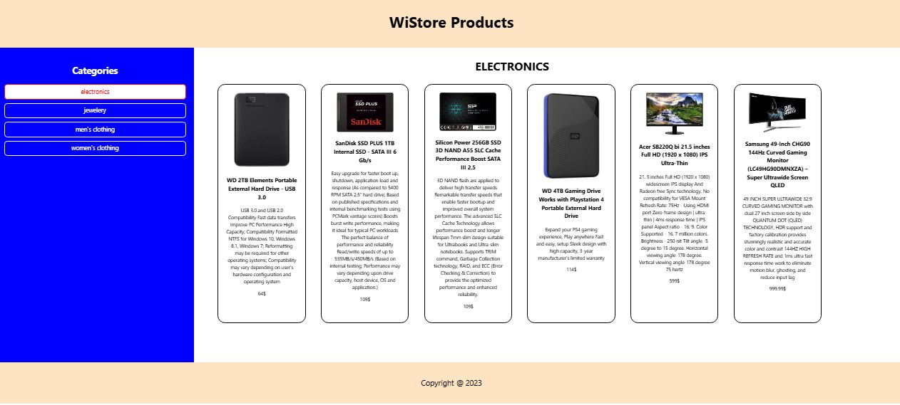
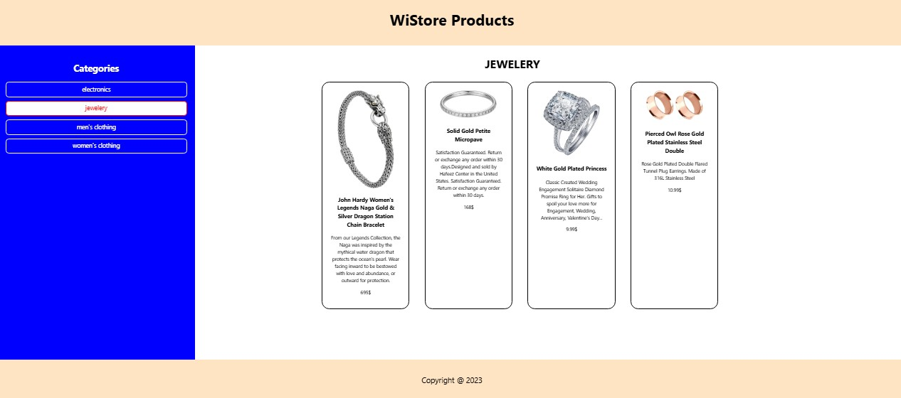
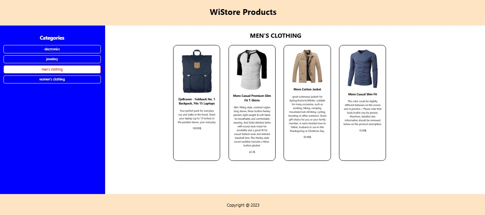
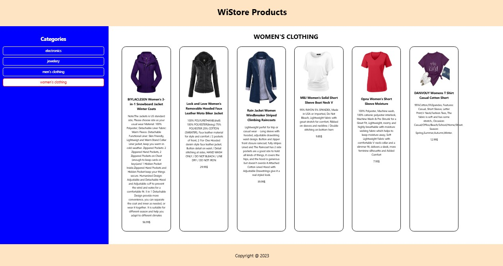

# React FakeStore Kategori/Ürün Listeleme

Kategorilere göre ürün listeleyen basit bir React uygulaması. **Fake Store API** üzerinden kategoriler alınır ve seçilen kategoriye göre ürünler listelenir.

---

## 📸 Ekran Görüntüleri

## ✨ Electronics Kategorisi


## ✨ Jewelery Kategorisi


## ✨ MenClothing Kategorisi


## ✨ WomenClothing Kategorisi



---

## ✨ Özellikler

* Kategoriler API’den çekilir ve yan menüde gösterilir
* Kategori seçildiğinde ürünler otomatik olarak güncellenir
* Seçilen kategori başlıkta görüntülenir

---

## 🧱 Mimarî

```
App
├── Header
├── SideBar (kategori seçimi)
├── Products (ürün listesi)
└── Footer
```

* **App**: `category` state’ini tutar.
* **SideBar**: Kategorileri API’den alır, seçimi App’e bildirir.
* **Products**: Seçilen kategoriye göre ürünleri API’den çeker.

---


## 🔌 API

* **Kategoriler**: `GET https://fakestoreapi.com/products/categories`
* **Ürünler**: `GET https://fakestoreapi.com/products/category/:category`

---


Bu README, projeyi hızlıca anlamak ve kullanmak için özet bilgi sağlar. 🎉
